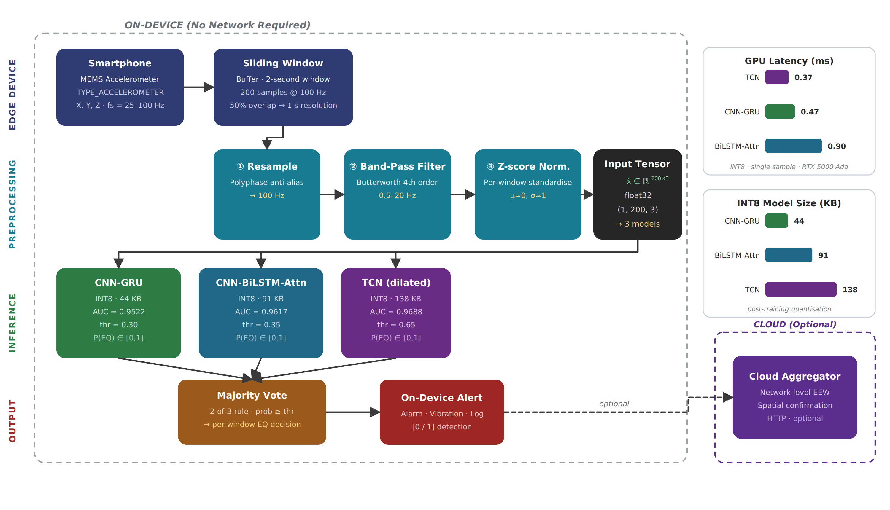
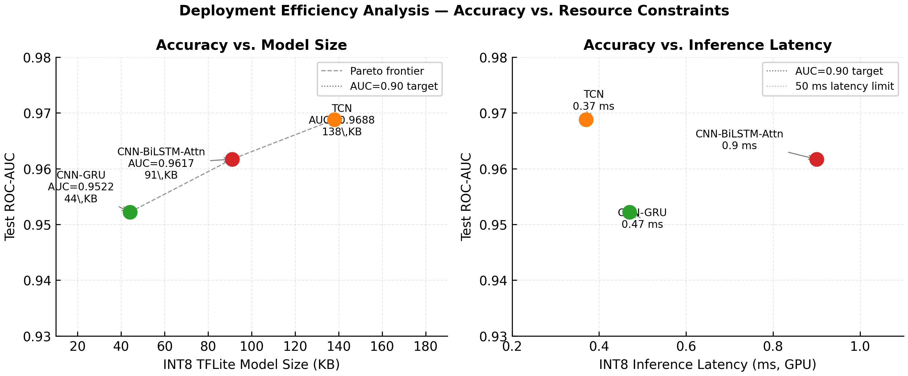
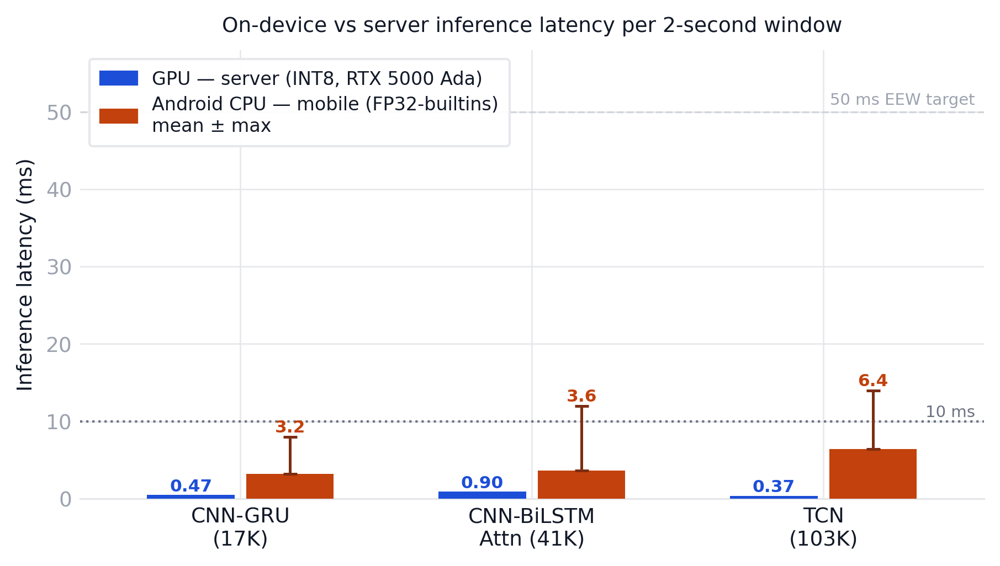
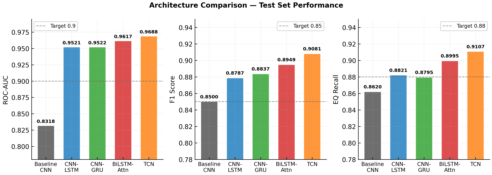

<p align="center">
  
</p>

<h1 align="center">Edge-AI Earthquake Early Warning</h1>

<h3 align="center">Real-Time Seismic Detection with Edge-AI: A Balanced Multi-Architecture Comparison</h3>

<p align="center">
  
  
  
  
  
</p>

<p align="center">
  <strong>Edge-AI · TFLite INT8 · Majority-Vote Ensemble · 35.4M Window Dataset · Android Deployment</strong>
</p>

<p align="center">
  Muhammed Şara
</p>

<p align="center">
  Department of Information Systems Engineering, Kocaeli University, Türkiye
</p>

<p align="center">
  <a href="#introduction">Introduction</a> •
  <a href="#main-results">Key Results</a> •
  <a href="#methodology">Methodology</a> •
  <a href="#repository-structure">Structure</a> •
  <a href="#getting-started">Quick Start</a> •
  <a href="#pre-trained-models">Models</a> •
  <a href="#citation">Citation</a>
</p>

---

### Introduction

This repository contains the source code, pre-trained models, and publication figures accompanying the paper **"Real-Time Seismic Detection with Edge-AI: A Balanced Comparison"**.

We propose an edge-to-cloud earthquake early warning (EEW) framework that runs entirely on a smartphone's on-device accelerometer, eliminating dependence on dedicated seismometer networks. Three systematic gaps motivate this work: (1) severe class imbalance in crowdsourced sensor streams, (2) the absence of multi-phase temporal modelling in lightweight mobile architectures, and (3) the lack of architecture-level deployment guidance across the edge-hardware spectrum. The core contribution is a systematic, balanced comparison of five deep learning architectures that addresses all three.

**Key Contributions:**
- **Unified Dataset** — 35.4 million 2-second accelerometer windows from 8 heterogeneous sources (AFAD broadband, TDG shake-table MEMS, STEAD earthquake traces, MyShake-shake, STEAD-Noise, MyShake-Human, UCI HAR, WISDM)
- **Balanced Evaluation** — A 79.74:1 class imbalance corrected to 1:1 via stratified index-based sampling, without modifying source data; a human-activity-inclusive balanced EEW evaluation framework
- **Five Architectures** — Systematic comparison spanning Baseline CNN → CNN-LSTM → CNN-GRU → CNN-BiLSTM-Bahdanau-Attention → Dilated TCN
- **On-Device Deployment** — INT8 TFLite quantisation (44–138 KB) with measured Android inference latency; majority-vote ensemble completes within 14 ms per 2-second window
- **Deployment Recommendations** — Architecture-to-hardware mapping covering microcontrollers, Android smartphones, and edge accelerators

---

### Main Results

**Table 1 — Architecture Comparison on Balanced Test Set** (*N* = 200,000, 1:1 EQ:NonEQ)

| Phase | Model | Params | AUC | F1 | EQ Recall | Gap |
|-------|-------|--------|-----|----|-----------|-----|
| Ph. 1 | Baseline CNN † | 28K | 0.8318 | 0.850 | 0.862 | 0.109 |
| Ph. 2 | CNN-LSTM | 35K | 0.9521 | 0.8787 | 0.8821 | 0.009 |
| Ph. 2 | CNN-GRU | 17K | 0.9522 | 0.8837 | 0.8795 | 0.007 |
| Ph. 2 | CNN-BiLSTM-Attn | 41K | 0.9617 | 0.8949 | 0.8995 | 0.004 |
| Ph. 3 | TCN | 103K | 0.9688 | 0.9081 | 0.9107 | 0.007 |

> Gap = train AUC − val AUC at final epoch, reported as raw ΔAUC (e.g., 0.004 means a 4-in-the-third-decimal difference). Lower = better generalisation.  
> † Baseline CNN was trained on the imbalanced dataset (79.74:1 EQ:NonEQ). The 0.109 ΔAUC gap reflects both model capacity limitations and imbalance effects. When the same architecture is retrained on the balanced 1:1 dataset, the gap drops to 0.009 — confirming class imbalance as the primary driver. All Phase 2–3 models are trained on the balanced dataset.

**Table 2 — On-Device Inference Latency**

| Model | INT8 Size | Android Mean | Android Peak | GPU (INT8) |
|-------|-----------|-------------|-------------|-----------|
| CNN-GRU | 44 KB | 3.2 ms | 8 ms | 0.47 ms |
| CNN-BiLSTM-Attn | 91 KB | 3.6 ms | 12 ms | 0.90 ms |
| TCN | 138 KB | 6.4 ms | 14 ms | 0.37 ms |
| Ensemble (3 models) | — | 13.5 ms | ~33 ms | — |

> All values below the 50 ms EEW latency target. Android measurements on a commercial mid-range device (FP32-builtins variants, 239–486 KB).

<p align="center">
  
</p>

> CNN-BiLSTM-Attention is the **Pareto-optimal** operating point for Android deployment: 99.3% of TCN accuracy at 65.9% of its INT8 model size.

---

### Methodology

```
┌─────────────────────┐   ┌─────────────────────────────┐   ┌──────────────────────────┐
│  8-Source Dataset   │   │  Preprocessing Pipeline     │   │  Architecture Comparison  │
│                     │   │                             │   │                          │
│  AFAD broadband  ───┼──▶│  Resample → 100 Hz          │──▶│  Ph.1  Baseline CNN      │
│  TDG shake-table ───┤   │  Butterworth BP 0.5–20 Hz   │   │  Ph.2  CNN-LSTM          │
│  STEAD (eq)      ───┤   │  Z-score (per-window)       │   │        CNN-GRU ★         │
│  MyShake-shake   ───┤   │  Window: 200 samples (2 s)  │   │        CNN-BiLSTM-Attn ★ │
│  STEAD-Noise     ───┤   │  Stride: 100 samples (1 s)  │   │  Ph.3  Dilated TCN ★     │
│  MyShake-Human   ───┤   │                             │   │                          │
│  UCI HAR         ───┤   │  Balanced Sampling          │   │  ★ = TFLite deployed     │
│  WISDM           ───┘   │  79.74:1 → 1:1 (seed=42)   │   │                          │
└─────────────────────────┘  └───────────────────────────┘   └──────────────────────────┘
                                                                          │
                                                           ┌──────────────▼─────────────┐
                                                           │  Android Ensemble App      │
                                                           │  Majority vote (≥2/3)      │
                                                           │  14 ms / 2-second window   │
                                                           └────────────────────────────┘
```

**Preprocessing Pipeline:**
1. Resample to 100 Hz
2. 4th-order Butterworth band-pass filter (0.5–20 Hz)
3. Per-window z-score normalisation
4. 200-sample (2 s) sliding windows, 100-sample (1 s) stride

**Majority-Vote Ensemble:**

| Model | Detection Threshold |
|-------|-------------------|
| CNN-GRU | 0.30 |
| CNN-BiLSTM-Attn | 0.35 |
| TCN | 0.65 |

Alarm triggered when ≥ 2 of 3 models exceed their respective thresholds.

<p align="center">
  
</p>

---

### Repository Structure

```
realtimeeq/
├── README.md                              # This file
├── LICENSE                                # MIT License
├── requirements.txt                       # Python dependencies
├── .gitignore
│
├── src/                                   # Source code
│   ├── models/
│   │   ├── baseline_cnn.py                #   Phase 1 — Baseline 1D-CNN
│   │   ├── hybrid_models.py               #   Phase 2 — CNN-LSTM, CNN-BiLSTM-Attn, CNN-GRU
│   │   └── tcn.py                         #   Phase 3 — Dilated TCN
│   ├── data/
│   │   └── preprocessor.py                #   Signal preprocessing pipeline
│   └── deployment/
│       └── tflite_converter.py            #   TFLite INT8 conversion
│
├── models/                                # Pre-trained TFLite models
│   ├── int8/                              #   INT8 quantised (GPU / high-end edge)
│   │   ├── cnn_gru_int8.tflite            #     45 KB
│   │   ├── cnn_bilstm_attn_int8.tflite    #     91 KB
│   │   └── tcn_int8.tflite                #    138 KB
│   └── android/                           #   FP32-builtins (Android CPU compatible)
│       ├── cnn_gru_builtins.tflite        #    239 KB
│       ├── cnn_bilstm_attn_builtins.tflite#    486 KB
│       └── tcn_builtins.tflite            #    417 KB
│
├── figures/                               # Publication figures (PNG)
│   ├── fig_system_architecture.png
│   ├── fig1_roc_curves.png
│   ├── fig2_performance_summary.png
│   ├── fig3_deployment_pareto.png
│   ├── fig4_attention_weights.png
│   └── fig5_mobile_inference.png
│
└── scripts/
    └── reproduce_figures.py               # Regenerate figures from raw results
```

> **Dataset**: The full 35.4 M window HDF5 dataset (~60 GB) is not hosted on GitHub. See [Data Availability](#data-availability) below.

---

### Getting Started

#### Prerequisites

- Python ≥ 3.8
- TensorFlow ≥ 2.15
- CUDA (optional, for GPU training)

#### Installation

```bash
git clone https://github.com/muhammedsara/realtimeeq.git
cd realtimeeq
pip install -r requirements.txt
```

#### Run a Pre-trained Model

```python
import numpy as np
import tensorflow as tf

# Load INT8 model (GPU / server)
interpreter = tf.lite.Interpreter(model_path="models/int8/cnn_gru_int8.tflite")
interpreter.allocate_tensors()

input_details  = interpreter.get_input_details()
output_details = interpreter.get_output_details()

# 2-second window: (1, 200, 3) — 100 Hz, 3-axis, z-score normalised
window = np.random.randn(1, 200, 3).astype(np.float32)
interpreter.set_tensor(input_details[0]['index'], window)
interpreter.invoke()

prob = interpreter.get_tensor(output_details[0]['index'])[0, 0]
print(f"P(earthquake) = {prob:.4f}")
```

#### Use the Preprocessing Pipeline

```python
from src.data.preprocessor import SignalPreprocessor

preprocessor = SignalPreprocessor(
    target_sr=100.0,
    filter_low=0.5,
    filter_high=20.0,
    filter_order=4,
    normalization="zscore",
    window_size=200,
    window_stride=100,
)

# raw_signal: np.ndarray, shape (n_samples, 3), original_sr: Hz
windows = preprocessor.process_and_window(raw_signal, original_sr=50.0)
# windows.shape → (n_windows, 200, 3)
```

#### Train an Architecture

```python
from src.models.hybrid_models import build_cnn_bilstm_attention, compile_hybrid

model = build_cnn_bilstm_attention(input_shape=(200, 3))
model = compile_hybrid(model)
model.summary()

# model.fit(train_gen, validation_data=val_gen, epochs=50, ...)
```

---

### Pre-trained Models

| File | Architecture | Format | Size | AUC | Android Mean |
|------|-------------|--------|------|-----|-------------|
| `int8/cnn_gru_int8.tflite` | CNN-GRU | INT8 | 45 KB | 0.9522 | — |
| `int8/cnn_bilstm_attn_int8.tflite` | CNN-BiLSTM-Attn | Partial INT8 | 91 KB | 0.9617 | — |
| `int8/tcn_int8.tflite` | TCN | INT8 | 138 KB | 0.9688 | — |
| `android/cnn_gru_builtins.tflite` | CNN-GRU | FP32-builtins | 239 KB | 0.9522 | 3.2 ms |
| `android/cnn_bilstm_attn_builtins.tflite` | CNN-BiLSTM-Attn | FP32-builtins | 486 KB | 0.9617 | 3.6 ms |
| `android/tcn_builtins.tflite` | TCN | FP32-builtins | 417 KB | 0.9688 | 6.4 ms |

**Which variant to use:**
- **Android deployment** → use `android/` variants (TFLITE_BUILTINS compatible, no Flex delegate required)
- **GPU server / edge accelerator** → use `int8/` variants
- **Recommended single model** → `cnn_gru_builtins.tflite` (best latency), `cnn_bilstm_attn_builtins.tflite` (best accuracy/size tradeoff)

---

### Evaluation Metrics

| Metric | Definition |
|--------|------------|
| **AUC** | Area under the ROC curve — primary ranking metric, threshold-independent |
| **F1-score** | Harmonic mean of precision and recall at the optimal threshold |
| **EQ Recall** | Fraction of true earthquakes detected — critical for EEW (miss cost > false alarm cost) |
| **Non-EQ Precision** | Fraction of positive predictions that are true earthquakes |
| **Overfitting Gap** | train AUC − val AUC at final epoch; Phase 2–3 models achieve < 0.01 pt (well-regularised); see † for Baseline context |

All metrics are reported on the **balanced test set** (200,000 windows, 1:1 EQ:NonEQ). The original 79.74:1 imbalance means a trivial "always predict earthquake" classifier achieves 98.7% accuracy — making the balanced evaluation essential for meaningful comparison.

<p align="center">
  
</p>

---

### Data Availability

The full unified dataset (`unified_dataset_v1.hdf5`, ~60 GB, 35.4 M windows) is available upon request. The balanced sampling index (`balanced_indices_v1.json`, ~20 MB, seed=42) is provided separately and enables exact reproduction without redistributing the raw data.

Data sources used (8 heterogeneous sources, 35.4 M windows total):
| # | Source | Label | Sensor Type |
|---|--------|-------|-------------|
| 1 | AFAD Broadband Network (93,442 records) | EQ | Seismometer |
| 2 | TDG Shake-Table MEMS (29 records) | EQ | MEMS accelerometer |
| 3 | STEAD earthquake traces (13,000 records) | EQ | Seismometer |
| 4 | MyShake-shake (192 records) | EQ | Smartphone MEMS |
| 5 | STEAD-Noise (15,000 records) | Non-EQ | Seismometer |
| 6 | MyShake-Human (613 records) | Non-EQ | Smartphone MEMS |
| 7 | UCI HAR (10,299 records) | Non-EQ | Body-worn IMU |
| 8 | WISDM (54,000 records) | Non-EQ | Smartphone IMU |

---

### Acknowledgements

This work was conducted at the Department of Information Systems Engineering, **Kocaeli University**, Türkiye.

The authors thank:
- [AFAD](https://deprem.afad.gov.tr/) for providing broadband seismometer recordings from the Turkish national network
- [STEAD](https://github.com/smousavi05/STEAD) (Mousavi et al., 2019) for the publicly available seismic dataset
- TDG (Teknik Destek Grubu) Vibration and Dynamics Laboratory for shake-table MEMS recordings
- UCI Machine Learning Repository for the HAR dataset
- WISDM Lab, Fordham University for the activity recognition dataset
- [MyShake](https://myshake.berkeley.edu/) (Kong et al., 2016) for the smartphone seismic and human-activity datasets

---

### Citation

If you use this work in your research, please cite it as follows:

```bibtex
@article{sara2026eew,
  title   = {Real-Time Seismic Detection with Edge-AI: A Balanced Comparison},
  author  = {{\c{S}}ara, Muhammed and others},
  year    = {2026},
  note    = {Manuscript in preparation}
}
```


---

### Contact

For questions or bug reports, please open an issue or contact **muhammedsaraa@gmail.com** and **kurtar1001@gmail.com**.

---

### License

This project is licensed under the MIT License — see the [LICENSE](LICENSE) file for details.
